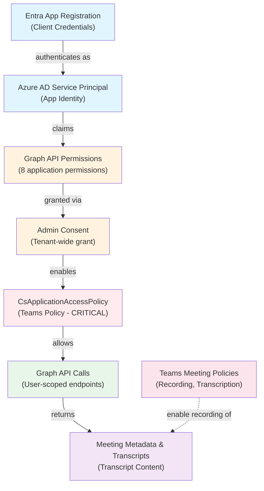

# Access and Permissions Guide: Teams Meeting Fetcher

**Purpose:** Complete end-to-end documentation of every access layer required for the Teams Meeting Fetcher to read Teams meeting transcripts via the Microsoft Graph API.

**Audience:** DevOps engineers, Teams administrators, and application architects who need to understand how access flows through the system.

**Scope:** This guide covers Entra app registration, Graph API permissions, CsApplicationAccessPolicy, and Teams meeting policies — the complete permission chain from app identity to transcript content.

---

## Quick Navigation

- **[Architecture Overview](#architecture-overview)** — Visual flow of access layers
- **[Service Principal Matrix](#service-principal-matrix)** — All SPNs and their permission requirements
- **[Access Layers](#access-layers)** — What each layer does and when it fails
- **[Setup Instructions](#setup-instructions)** — Step-by-step configuration
- **[API Path Reference](#api-path-reference)** — Correct endpoints for app-only auth
- **[Common Pitfalls & Lessons Learned](#common-pitfalls--lessons-learned)** — Hard-won troubleshooting
- **[Verification Checklist](#verification-checklist)** — Test each layer
- **[Cross-References](#cross-references)** — Links to related docs

---

## Architecture Overview

The Teams Meeting Fetcher uses **app-only authentication** (client credentials flow) to access online meetings and transcripts on behalf of users. Access flows through six sequential layers:



**Key insight:** Without **Layer 5 (CsApplicationAccessPolicy)**, all other layers are in place but Graph API returns **403 Forbidden** with "No application access policy found for this app" — even if all Graph permissions are granted.

---

## Service Principal Matrix

The Teams Meeting Fetcher system uses **5 distinct Service Principal Names (SPNs)** with very different privilege levels. Understanding which SPN needs which permissions is critical for security and troubleshooting.

### Summary Table

| SPN                               | Purpose                                  | Permission Type | Permission Count | Privilege Level | Provisioned By | CsApplicationAccessPolicy Required? |
| --------------------------------- | ---------------------------------------- | --------------- | ---------------- | --------------- | -------------- | ----------------------------------- |
| **TMF App**                       | Main app (polling, enrichment, webhooks) | Application     | 8                | **HIGH**        | IaC + Bootstrap | ✅ YES                              |
| **TMF Bot App**                   | Teams meeting bot (join meetings)        | Application     | 5                | Medium          | IaC + Bootstrap | ❌ NO                               |
| **TMF Lambda App**                | AWS Lambda EventHub consumer             | None            | 0                | None (EventHub) | IaC only       | ❌ NO                               |
| **TMF Admin App**                 | Admin UI (user sign-in)                  | Delegated       | 4                | Low (user auth) | IaC only       | ❌ NO                               |
| **Deploy SPN** (GitHub Actions)   | CI/CD infrastructure deployment          | Application     | 1–2              | High (IaC only) | Manual (pre-req) | ❌ NO                               |

**Key takeaway:** Only the **TMF App** requires the full set of application permissions and CsApplicationAccessPolicy. All other SPNs have narrower scopes and lower privileges.

---

### How Permissions Get Set

Permissions flow through a **3-step pipeline**. Understanding this prevents the common "but I already added it!" confusion:

| Step | What It Does | Tool | Files/Commands |
| ---- | ------------ | ---- | -------------- |
| **1. App Registration** | Declares `requiredResourceAccess` (what the app *wants*) | Terraform | `iac/azure/modules/azure-ad/main.tf` — `azuread_application` resources |
| **2. Admin Consent** | Grants the declared permissions (what the app *actually gets*) | Bootstrap script | `scripts/grant-graph-permissions.ps1` or `scripts/auto-bootstrap-azure.ps1` |
| **3. CsApplicationAccessPolicy** | Teams-specific policy allowing app to access OnlineMeetings/Transcripts | Teams PowerShell | `New-CsApplicationAccessPolicy` + `Grant-CsApplicationAccessPolicy` (manual) |

**Step 1 (IaC)** runs on every `terraform apply` via `deploy-unified.yml`. It creates the app registrations and declares which permissions each app needs — but this alone does NOT grant access.

**Step 2 (Bootstrap)** is a one-time step (or after adding new permissions). Two options:
- `scripts/grant-graph-permissions.ps1` — Manual, runs with `az` CLI credentials
- `scripts/auto-bootstrap-azure.ps1` — Automated, runs all bootstrap steps including permissions
- Terraform can also do this if `var.grant_admin_consent = true` (requires `AppRoleAssignment.ReadWrite.All` on the Deploy SPN — currently **OFF**)

**Step 3 (Teams PowerShell)** is manual and only applies to the TMF App. It takes ~30 minutes to propagate.

#### Per-SPN Provisioning Details

| SPN | App Registration (Step 1) | Admin Consent (Step 2) | CsApplicationAccessPolicy (Step 3) |
| --- | ------------------------- | ---------------------- | ----------------------------------- |
| **TMF App** | `azuread_application.tmf_app` in Terraform | `grant-graph-permissions.ps1` (8 app role assignments) | Manual via Teams PowerShell |
| **TMF Bot App** | `azuread_application.tmf_bot_app` in Terraform | `grant-graph-permissions.ps1` (5 app role assignments) | N/A |
| **TMF Lambda App** | `azuread_application.tmf_lambda_app` in Terraform | N/A (no Graph perms) — EventHub RBAC via Terraform | N/A |
| **TMF Admin App** | `azuread_application.tmf_admin_app` in Terraform | Delegated perms — user consent at first sign-in | N/A |
| **Deploy SPN** | Pre-existing (manual Azure Portal setup) | Manual Azure Portal grant | N/A |

---

### Detailed Permission Breakdown

#### 1. TMF App (Teams Meeting Fetcher) — HIGHEST PRIVILEGES

**Purpose:** The main application backend. Handles:
- Meeting metadata polling
- Transcript and recording retrieval
- Calendar event management (sales blitz scripts)
- Graph API subscription webhooks
- Call record lifecycle notifications

**Permissions (8 Graph API application permissions):**

| Permission                           | Permission ID                          | Purpose                                         |
| ------------------------------------ | -------------------------------------- | ----------------------------------------------- |
| **Calendars.ReadWrite**              | `ef54d2bf-783f-4e0f-bca1-3210c0444d99` | Read/write calendar events (sales blitz create) |
| **Group.Read.All**                   | `5b567255-7703-4780-807c-7be8301ae99b` | Read group membership information               |
| **User.Read.All**                    | `df021288-bdef-4463-88db-98f22de89214` | Resolve email addresses to user GUIDs           |
| **OnlineMeetings.Read.All**          | `c1684f21-1984-47fa-9d61-2dc8c296bb70` | Read online meeting metadata (ID, URL)          |
| **OnlineMeetingTranscript.Read.All** | `a4a80d8d-d283-4bd8-8504-555ec3870630` | Read meeting transcripts                        |
| **OnlineMeetingRecording.Read.All**  | `a4a08342-c95d-476b-b943-97e100569c8d` | Read meeting recordings                         |
| **CallRecords.Read.All**             | `45bbb07e-7321-4fd7-a8f6-3ff27e6a81c8` | Receive call record lifecycle notifications     |
| ~~**Subscription.ReadWrite.All**~~   | N/A (delegated only)                   | ~~Create/manage webhook subscriptions~~         |

> **Note:** Subscription.ReadWrite.All is NOT a valid Graph application permission. Webhook subscriptions are created using the application permissions above via the `/subscriptions` endpoint.

**CsApplicationAccessPolicy:** ✅ **REQUIRED** — This is the only SPN that needs CsApplicationAccessPolicy to access OnlineMeetings, Transcripts, and Recordings endpoints.

**Where it's used:**
- Admin app backend (`apps/admin/src/server/`)
- Graph webhook handlers
- Sales blitz scripts (`scenarios/sales-blitz/`)

---

#### 2. TMF Bot App (Teams Meeting Bot)

**Purpose:** Azure Bot Service identity for the bot that joins Teams meetings.

**Permissions (5 Graph API application permissions):**

| Permission                           | Permission ID                          | Purpose                                 |
| ------------------------------------ | -------------------------------------- | --------------------------------------- |
| **OnlineMeetings.ReadWrite.All**     | `b8bb2037-4d54-4e14-9d63-174b619e831f` | Join/create meetings as bot            |
| **OnlineMeetingTranscript.Read.All** | `a4a80d8d-d283-4bd8-8504-555ec3870630` | Read transcripts after joining          |
| **OnlineMeetingRecording.Read.All**  | `a4a08342-c95d-476b-b943-97e100569c8d` | Read recordings after joining           |
| **Group.Read.All**                   | `5b567255-7703-4780-807c-7be8301ae99b` | Read group membership                   |
| **User.Read.All**                    | `df021288-bdef-4463-88db-98f22de89214` | Resolve user identities                 |

**Sign-in audience:** Multi-tenant (required by Teams Admin Center for Bot Framework registration)

**CsApplicationAccessPolicy:** ❌ **NOT REQUIRED** — Bot uses its own authentication flow via Bot Framework.

**Where it's used:**
- Azure Bot Service
- Teams bot registration

---

#### 3. TMF Lambda App (AWS Lambda EventHub Consumer)

**Purpose:** AWS Lambda function identity for consuming EventHub messages.

**Permissions:** **ZERO Graph API permissions**

**Access method:** EventHub read access via:
- EventHub SAS token, OR
- Azure RBAC (Azure Event Hubs Data Receiver role)

**CsApplicationAccessPolicy:** ❌ **NOT REQUIRED** — Does not call Graph API.

**Where it's used:**
- AWS Lambda function (`iac/aws/lambda/`)
- EventHub consumer in `apps/admin/src/lambda/`

---

#### 4. TMF Admin App (Admin UI OIDC)

**Purpose:** User authentication for the management UI (web app sign-in).

**Permissions (4 Graph API delegated permissions):**

| Permission     | Permission ID                          | Purpose                              |
| -------------- | -------------------------------------- | ------------------------------------ |
| **openid**     | `37f7f235-527c-4136-accd-4a02d197296e` | OpenID Connect authentication        |
| **profile**    | `14dad69e-099e-4568-8e68-91aaf2e80f89` | Read user profile information        |
| **email**      | `64a6cdd6-ae6a-41a4-9de4-799360050bf8` | Read user email address              |
| **User.Read**  | `e1fe6dd8-bbce-4cd8-94f0-4511779dde5e` | Read signed-in user's profile        |

**Permission type:** **Delegated** (user sign-in flow, NOT app-only)

**Sign-in audience:** Single-tenant (AzureADMyOrg)

**Group membership claims:** Enabled for RBAC (Admin UI role checks)

**CsApplicationAccessPolicy:** ❌ **NOT REQUIRED** — User authentication flow only.

**Where it's used:**
- Admin UI login flow (`apps/admin/src/client/`)

---

#### 5. Deploy SPN (GitHub Actions)

**Purpose:** CI/CD automation for deploying Azure resources (pre-existing, not managed by Terraform).

**Permissions (Graph API application permissions):**

| Permission                            | Permission ID                          | Purpose                                      | Status         |
| ------------------------------------- | -------------------------------------- | -------------------------------------------- | -------------- |
| **Application.ReadWrite.All**         | `1bfefb4e-e0b5-418b-a88f-73c46d2cc8e9` | Manage app registrations via IaC             | ✅ Required    |
| **AppRoleAssignment.ReadWrite.All**   | `06b708a9-e830-4db3-a914-8e69da51d44f` | Grant admin consent via IaC (optional)       | Currently OFF  |

**Current configuration:** `var.grant_admin_consent = false` — Admin consent must be granted manually via Azure Portal or PowerShell.

**CsApplicationAccessPolicy:** ❌ **NOT REQUIRED** — Infrastructure deployment only.

**Where it's used:**
- `.github/workflows/deploy-unified.yml`
- `.github/workflows/deploy-admin-app.yml`

---

### Security Principle

**Least Privilege by Design:**
- Only 1 of 5 SPNs (TMF App) has the full 8-permission set and CsApplicationAccessPolicy
- The Bot, Lambda, Admin UI, and Deploy SPNs have narrower scopes appropriate to their functions
- Separating these identities prevents credential compromise from escalating beyond one subsystem

---

## Access Layers

### Layer 1: Entra App Registration & Client Credentials

**What it is:** Azure AD app registration configured for client credentials (app-only) authentication.

**Purpose:** Establishes the app's identity; the service principal acts as the requesting entity for all Graph API calls.

**Configuration:**

- **Application (Client) ID** — used in token requests
- **Client Secret** — used to prove identity (kept secret, never logged)
- **Tenant ID** — specifies which Azure AD tenant to authenticate against

**How to verify:**

```powershell
# Azure AD app exists
az ad app show --id "<CLIENT_ID>"

# Service principal exists
az ad sp show --id "<CLIENT_ID>"

# Client credentials flow works
curl -X POST "https://login.microsoftonline.com/<TENANT_ID>/oauth2/v2.0/token" \
  -d "grant_type=client_credentials" \
  -d "client_id=<CLIENT_ID>" \
  -d "client_secret=<CLIENT_SECRET>" \
  -d "scope=https://graph.microsoft.com/.default"
# Expected: Returns access_token
```

**Failure symptoms:**

- `AADSTS700016` — Client credentials are invalid or the app does not exist
- `AADSTS50058` — Silent sign-in failed; tenant not found

---

### Layer 2: Graph API Application Permissions (8 Required for TMF App)

**What it is:** Application-level permissions that authorize the service principal to read specific Microsoft Graph resources.

**Why "application" not "delegated":** The app reads data on behalf of users without impersonating them. No user is signed in.

**Required permissions for TMF App (all 8 must be granted):**

| Permission                           | Permission ID                          | Purpose                                         |
| ------------------------------------ | -------------------------------------- | ----------------------------------------------- |
| **Calendars.ReadWrite**              | `ef54d2bf-783f-4e0f-bca1-3210c0444d99` | Read/write calendar events (sales blitz create) |
| **Group.Read.All**                   | `5b567255-7703-4780-807c-7be8301ae99b` | Read group membership and properties            |
| **User.Read.All**                    | `df021288-bdef-4463-88db-98f22de89214` | Read user profiles (resolve email → GUID)       |
| **OnlineMeetings.Read.All**          | `c1684f21-1984-47fa-9d61-2dc8c296bb70` | Read online meeting metadata (ID, URL)          |
| **OnlineMeetingTranscript.Read.All** | `a4a80d8d-d283-4bd8-8504-555ec3870630` | Read meeting transcripts                        |
| **OnlineMeetingRecording.Read.All**  | `a4a08342-c95d-476b-b943-97e100569c8d` | Read meeting recordings                         |
| **CallRecords.Read.All**             | `45bbb07e-7321-4fd7-a8f6-3ff27e6a81c8` | Receive call record lifecycle notifications     |

> **Note:** The Subscription.ReadWrite.All permission listed in older docs is NOT a valid Graph application permission. Webhook subscriptions are created using the permissions above.

**Why all 8:**

- **Calendars.ReadWrite** — Retrieve and create calendar events (meeting invites, sales blitz scripts)
- **Group.Read.All, User.Read.All** — Resolve user email addresses to GUIDs (required for app-only onlineMeetings API)
- **OnlineMeetings.Read.All** — Query `/users/{userId}/onlineMeetings` to find meeting details
- **OnlineMeetingTranscript.Read.All, OnlineMeetingRecording.Read.All** — Access transcript/recording content
- **CallRecords.Read.All** — Receive call record lifecycle notifications via Graph subscriptions

**How to verify:**

```powershell
# Check permissions are granted in Azure Portal:
# 1. Portal → Azure AD → App registrations → Your app (TMF App)
# 2. Click "API permissions"
# 3. Verify all 8 permissions listed with status "✓ Granted for [Your Tenant]"

# OR via Azure CLI
az ad app permission list --id "<CLIENT_ID>"
```

**Failure symptoms:**

- `AADSTS650053` — Application lacks required permissions (403 Forbidden from Graph)
- Missing transcripts in Graph responses despite CsApplicationAccessPolicy being set

---

### Layer 3: Admin Consent

**What it is:** Tenant administrator approval to grant the service principal access to the 7 permissions.

**Purpose:** Without admin consent, permissions are "requested" but not active. Graph API will deny calls claiming insufficient privileges.

**One-time process:** After initial consent, the grant applies to all future calls from the app.

**How to grant:**

- **Azure Portal:** App registrations → API permissions → "Grant admin consent for [Tenant]" button
- **PowerShell:** `New-AzureADServiceAppRoleAssignment` (see `scripts/grant-graph-permissions.ps1`)

**How to verify:**

```powershell
# Check each permission has "Granted" status
Connect-MgGraph -Scopes "Application.ReadWrite.All"
$app = Get-MgApplication -Filter "appId eq '<CLIENT_ID>'"
$app.RequiredResourceAccess | ForEach-Object {
    $_.ResourceAccess | ForEach-Object {
        Write-Host "Permission ID: $($_.Id), Type: $($_.Type)"
    }
}
```

**Failure symptoms:**

- `AADSTS65001` — User or admin has not consented to use the application
- Graph API returns 403 with "Insufficient privileges" (NOT the same as "No application access policy")

**Propagation timeline:** 10–15 minutes after granting consent.

---

### Layer 4: CsApplicationAccessPolicy (CRITICAL — Teams Policy)

**What it is:** A Teams-specific authorization policy that explicitly allows the app to access users' online meetings via the Graph API `/users/{userId}/onlineMeetings` endpoint.

**Why it's separate from Graph permissions:**

- **Graph permissions** authorize actions on Microsoft Graph resources
- **CsApplicationAccessPolicy** is a **Teams admin policy** that sits above Graph permissions; it gates access to user-scoped online meeting data
- Even with all Graph permissions granted and admin-consented, without this policy, Graph returns **403 "No application access policy found for this app"**

**What it does:**

- Registers the app's client ID in Teams
- Grants the app permission to read the `/users/{userId}/onlineMeetings/*` hierarchy
- Can be assigned globally or to specific users

**How to create:**

```powershell
Connect-MicrosoftTeams

# Create the policy
New-CsApplicationAccessPolicy `
  -Identity "TMF-AppAccess-Policy" `
  -AppIds "<YOUR_APP_ID>" `
  -Description "Allow Teams Meeting Fetcher app to access online meetings"

# Grant globally (recommended for production after testing)
Grant-CsApplicationAccessPolicy -PolicyName "TMF-AppAccess-Policy" -Global

# OR grant to specific user(s) (for testing)
Grant-CsApplicationAccessPolicy `
  -PolicyName "TMF-AppAccess-Policy" `
  -Identity "user@yourtenant.com"
```

**How to verify:**

```powershell
# Policy exists
Get-CsApplicationAccessPolicy -Identity "TMF-AppAccess-Policy"

# User has policy assigned
Get-CsOnlineUser -Identity "user@yourtenant.com" | Select-Object ApplicationAccessPolicy

# Expected output: "TMF-AppAccess-Policy"
```

**Failure symptoms:**

- **403 Forbidden** with message "No application access policy found for this app"
- Appears in Graph API response body or Azure AD sign-in logs
- Happens despite all Graph permissions being granted and consented

**Propagation timeline:** **Up to 30 minutes.** Changes to CsApplicationAccessPolicy are cached across Microsoft 365 infrastructure. If you just created the policy, wait 30 minutes before testing Graph API calls to `/users/{userId}/onlineMeetings`.

**Critical lesson learned:** This policy is often **missed** during setup because it's not visible in Azure Portal (it's Teams-specific). Teams admins and app developers often don't realize it's required until they hit the 403 error in production.

---

### Layer 5: Teams Meeting Policies

**What it is:** Tenant-wide (or group-scoped) Teams admin policies that control whether meetings are recorded and transcribed.

**Why it matters:** Even if all previous layers are in place, if the meeting was never recorded/transcribed, there is no transcript to fetch via Graph API.

**Required settings:**

- **AllowTranscription** — `$true` (allows transcription)
- **AllowCloudRecording** — `$true` (allows recording)
- **AutoRecording** — `Enabled` (automatically starts recording on meeting start; does not require user action)

**How to set:**

```powershell
Connect-MicrosoftTeams

Set-CsTeamsMeetingPolicy -Identity Global `
  -AllowCloudRecording $true `
  -AllowTranscription $true `
  -AutoRecording Enabled
```

**How to verify:**

```powershell
Get-CsTeamsMeetingPolicy -Identity Global | Select-Object `
  AllowCloudRecording, AllowTranscription, AutoRecording
```

**Failure symptoms:**

- Graph API call to `/users/{userId}/onlineMeetings/{id}/transcripts` returns empty array
- Meeting doesn't appear to have been recorded (no transcripts available)

**Related:** [TEAMS_ADMIN_CONFIGURATION.md](docs/TEAMS_ADMIN_CONFIGURATION.md) for detailed Teams admin setup.

---

## Setup Instructions

### Prerequisites

- **Azure AD Global Administrator or Application Administrator** role (to grant Graph permissions)
- **Teams Administrator** role (to create CsApplicationAccessPolicy)
- **PowerShell 5.1+** (for Teams PowerShell module)
- **Azure CLI** (for verification, optional)

### Step 1: Entra App Registration Setup (One-Time)

If your Entra app registration is already created, skip to Step 2.

```powershell
# Create app registration
$app = az ad app create --display-name "Teams-Meeting-Fetcher" --query appId -o tsv

# Create service principal
az ad sp create --id $app

# Save the app ID (you'll need it for subsequent steps)
echo "App ID: $app"
```

After creation, create a client secret (in Azure Portal):

1. Navigate to **Azure Portal** → **Azure AD** → **App registrations** → Your app
2. Click **Certificates & secrets**
3. Click **New client secret** → add a description → copy the value
4. Store securely (this is the `GRAPH_CLIENT_SECRET`)

### Step 2: Grant Graph API Permissions (One-Time)

Automated script (recommended):

```powershell
.\scripts\grant-graph-permissions.ps1 -AppId "<YOUR_APP_ID>" -TenantId "<YOUR_TENANT_ID>"
```

Or manually in Azure Portal:

1. **Azure Portal** → **App registrations** → Your app
2. **API permissions** → **Add a permission**
3. Search for each of these permissions and add them:
   - `Calendars.ReadWrite`
   - `Group.Read.All`
   - `User.Read.All`
   - `OnlineMeetings.Read.All`
   - `OnlineMeetingTranscript.Read.All`
   - `OnlineMeetingRecording.Read.All`
   - `CallRecords.Read.All`
4. Click **Grant admin consent for [Your Tenant]**

### Step 3: Create CsApplicationAccessPolicy (One-Time)

**This step is often the source of 403 errors. Do not skip it.**

```powershell
# Requires Teams Administrator role
Connect-MicrosoftTeams

# Create the policy
New-CsApplicationAccessPolicy `
  -Identity "TMF-AppAccess-Policy" `
  -AppIds "<YOUR_APP_ID>" `
  -Description "Teams Meeting Fetcher Graph API access"

# Grant to all users (or specific users for testing)
Grant-CsApplicationAccessPolicy -PolicyName "TMF-AppAccess-Policy" -Global

# Wait 30 minutes for propagation!
Write-Host "Policy created. Waiting 30 minutes for propagation..."
Start-Sleep -Seconds 1800
```

### Step 4: Configure Teams Meeting Policies (Optional, Depends on Use Case)

If you want meetings to automatically record and transcribe:

```powershell
Connect-MicrosoftTeams

# Update global meeting policy
Set-CsTeamsMeetingPolicy -Identity Global `
  -AllowCloudRecording $true `
  -AllowTranscription $true `
  -AutoRecording Enabled
```

See [TEAMS_ADMIN_CONFIGURATION.md](docs/TEAMS_ADMIN_CONFIGURATION.md) for detailed meeting policy configuration.

### Step 5: Configure Application (Environment Variables)

After admin setup is complete, configure the application with credentials:

```bash
# Create .env file (never commit this!)
cp .env.example .env

# Edit with your values
GRAPH_TENANT_ID=<your-tenant-id>
GRAPH_CLIENT_ID=<your-app-client-id>
GRAPH_CLIENT_SECRET=<your-client-secret>
```

See [CONFIGURATION.md](CONFIGURATION.md) for complete configuration options.

---

## API Path Reference

### App-Only Auth vs. Delegated Auth

**This is critical:** The Graph API paths differ based on authentication type.

#### **App-Only Auth (What We Use)**

The Teams Meeting Fetcher uses **app-only authentication** (client credentials). This requires the `/users/{userId}/onlineMeetings` path hierarchy.

```
GET  /users/{userId}/onlineMeetings
     Required: userId must be a GUID (email/UPN will NOT work)

GET  /users/{userId}/onlineMeetings/{id}

GET  /users/{userId}/onlineMeetings/{id}/transcripts
     Lists all transcripts for a meeting

GET  /users/{userId}/onlineMeetings/{id}/transcripts/{transcriptId}
     Gets transcript metadata (but NOT content)

GET  /users/{userId}/onlineMeetings/{id}/transcripts/{transcriptId}/content?$format=text/vtt
     Gets actual transcript content
     CRITICAL: Must include $format=text/vtt query parameter, or endpoint returns 400
```

**Example from code** (transcriptService.ts, line 43):

```javascript
const apiPath = `/users/${userId}/onlineMeetings/${meeting.onlineMeetingId}/transcripts/${graphTranscriptId}/content`;
const contentResponse = await client
  .api(apiPath)
  .query({ $format: 'text/vtt' })
  .responseType('text')
  .get();
```

#### **Delegated Auth (NOT Used)**

If using delegated auth (user signed in), the paths are different:

```
GET  /me/onlineMeetings
     Requires /communications/onlineMeetings.ReadWrite permission

GET  /me/onlineMeetings/{id}/transcripts/{transcriptId}/content
     User-scoped, different path hierarchy
```

**Do NOT use delegated auth paths with app-only credentials—Graph will reject the request.**

---

### Resolving User IDs (GUID from Email/UPN)

Because `/users/{userId}/onlineMeetings` requires a GUID (not email), you must resolve email addresses to GUIDs:

```
GET  /users/{email}?$select=id
     Returns: { id: "<guid>" }

# Example (meetingService.ts, line 83):
const userResp = await client.api(`/users/${meeting.organizerEmail}`).select('id').get();
userId = userResp.id;  // GUID
```

### Resolving Online Meeting IDs (from JoinWebUrl)

Calendar events do **not** include `onlineMeetingId` directly. If needed, resolve via the join URL:

```
GET  /users/{userId}/onlineMeetings?$filter=JoinWebUrl eq '<url>'
     Returns: { value: [{ id: "...", joinUrl: "...", ... }] }

# Example (meetingService.ts, lines 90-98):
const escapedUrl = decodedUrl.replace(/'/g, "''");
const resp = await client
  .api(`/users/${userId}/onlineMeetings`)
  .filter(`JoinWebUrl eq '${escapedUrl}'`)
  .get();
onlineMeetingId = resp.value[0].id;
```

---

## Common Pitfalls & Lessons Learned

These are hard-won errors from real deployments. Read these carefully.

### Pitfall 1: Wrong Endpoint Path for App-Only Auth

| Symptom                                                                | Cause                                               | Fix                                                                                    |
| ---------------------------------------------------------------------- | --------------------------------------------------- | -------------------------------------------------------------------------------------- |
| **404 Not Found** on `/communications/onlineMeetings/{id}/transcripts` | Using delegated auth path with app-only credentials | Use `/users/{userId}/onlineMeetings/{id}/transcripts` instead (see API Path Reference) |
| **403 Forbidden** "not supported"                                      | Trying app-only auth on delegated-only endpoint     | Verify endpoint is user-scoped (`/users/{userId}/...`)                                 |

**Lesson:** The `/communications/onlineMeetings` path is **delegated auth only**. For app-only auth, you **must** use `/users/{userId}/onlineMeetings`.

---

### Pitfall 2: User ID Must Be GUID, Not Email

| Symptom                                                                  | Cause                                                          | Fix                                                                     |
| ------------------------------------------------------------------------ | -------------------------------------------------------------- | ----------------------------------------------------------------------- |
| **400 Bad Request** or **404 Not Found** on `/users/{id}/onlineMeetings` | Passing email address instead of GUID                          | Resolve email to GUID: `GET /users/{email}?$select=id` → use `id` field |
| Transcripts appear empty (null GUID)                                     | userId was resolved as email in code but used in app-only path | Always convert email to GUID before app-only API calls                  |

**Lesson:** In app-only auth with `/users/{userId}/onlineMeetings`, the `userId` **must be a GUID** (UUID format). Email addresses and UPNs will not work.

**Code pattern:**

```javascript
// WRONG — will fail with app-only auth
const resp = await client.api(`/users/${meeting.organizerEmail}/onlineMeetings`).get();

// CORRECT — resolve email to GUID first
const userResp = await client.api(`/users/${meeting.organizerEmail}`).select('id').get();
const userId = userResp.id; // GUID
const resp = await client.api(`/users/${userId}/onlineMeetings`).get();
```

---

### Pitfall 3: Missing $format Parameter on Transcript Content Endpoint

| Symptom                                             | Cause                                                             | Fix                                                |
| --------------------------------------------------- | ----------------------------------------------------------------- | -------------------------------------------------- |
| **400 Bad Request** on `/transcripts/{id}/content`  | Not including `$format=text/vtt` query parameter                  | Add `.query({ '$format': 'text/vtt' })` to request |
| Response is not transcript text but HTML error page | Endpoint doesn't know what format to return without the parameter | Always include the query parameter                 |

**Lesson:** The `/transcripts/{id}/content` endpoint is unusual: it requires a `$format` query parameter to specify output format. Without it, Graph API returns 400.

**Code pattern (from transcriptService.ts, line 48):**

```javascript
const contentResponse = await client
  .api(apiPath)
  .query({ $format: 'text/vtt' }) // REQUIRED
  .responseType('text')
  .get();
```

---

### Pitfall 4: CsApplicationAccessPolicy Not Created or Not Propagated

| Symptom                                                             | Cause                                    | Fix                                                            |
| ------------------------------------------------------------------- | ---------------------------------------- | -------------------------------------------------------------- |
| **403 Forbidden** "No application access policy found for this app" | Policy not created                       | Create with `New-CsApplicationAccessPolicy` (see Setup Step 3) |
| Same 403 immediately after creating policy                          | Policy not yet propagated                | Wait 30 minutes and retry                                      |
| Propagation timeout after 45 minutes                                | Tenant sync issue or app already deleted | Verify policy: `Get-CsApplicationAccessPolicy \| Format-List`  |

**Lesson:** **CsApplicationAccessPolicy is the most commonly missed layer.** It's Teams-specific (not visible in Azure Portal), takes 30 minutes to propagate, and without it, Graph API returns 403 even if all other layers are correctly configured.

**Verification (from TEAMS_ADMIN_CONFIGURATION.md, Step 2.3):**

```powershell
Get-CsApplicationAccessPolicy -Identity "TMF-AppAccess-Policy"
Get-CsOnlineUser -Identity "user@yourtenant.com" | Select-Object ApplicationAccessPolicy
# Should return: TMF-AppAccess-Policy
```

---

### Pitfall 5: Graph Permissions Not Consented (Admin Consent Missing)

| Symptom                                                             | Cause                                                  | Fix                                                                              |
| ------------------------------------------------------------------- | ------------------------------------------------------ | -------------------------------------------------------------------------------- |
| **403 Forbidden** "Insufficient privileges" (from Graph, not Teams) | Permissions added to app but admin consent not granted | Grant admin consent in Azure Portal or via `New-AzureADServiceAppRoleAssignment` |
| Permissions show "Requires admin consent" status in Azure Portal    | Waiting for consent flow to complete                   | Click "Grant admin consent for [Tenant]" button                                  |
| Permission grants "disappear" after some time                       | Tenant policy or incorrect permission assignment       | Re-run `grant-graph-permissions.ps1` or use Terraform                            |

**Lesson:** Adding permissions to the app registration is one step. **Admin consent is a separate step.** Without it, the service principal lacks the actual permission to access the resources.

---

### Pitfall 6: Transcript Does Not Exist (Empty Array from Graph)

| Symptom                                                | Cause                                    | Fix                                                                     |
| ------------------------------------------------------ | ---------------------------------------- | ----------------------------------------------------------------------- |
| Graph API returns `{ value: [] }` for `/transcripts`   | Meeting was not recorded/transcribed     | Verify Teams meeting policies allow auto-recording (see Layer 5)        |
| Transcripts appear hours later                         | Graph is still processing the transcript | Transcription takes 15–60 minutes after meeting ends                    |
| Transcript available in Teams client but not via Graph | Team members can see it but app cannot   | Verify CsApplicationAccessPolicy covers the meeting organizer's account |

**Lesson:** Graph API reflects what Teams has recorded and transcribed. If the meeting wasn't recorded (no Teams policy forcing it), or transcription is still processing, Graph will return an empty list.

---

### Pitfall 7: Calendar Event Doesn't Contain onlineMeetingId

| Symptom                                                               | Cause                                                  | Fix                                                                      |
| --------------------------------------------------------------------- | ------------------------------------------------------ | ------------------------------------------------------------------------ |
| `onlineMeetingId` field is missing from calendar event                | Event was created without Teams meeting option enabled | Resolve `onlineMeetingId` via JoinWebUrl filter (see API Path Reference) |
| Calendar subscription returns events but they don't have meeting data | Webhook fired before meeting was fully synced          | Retry the fetch a few minutes later                                      |

**Lesson:** Microsoft Graph Calendar API does **not** reliably populate `onlineMeetingId` from calendar events. You must resolve it separately via `/users/{userId}/onlineMeetings?$filter=JoinWebUrl eq '...'`.

---

### Pitfall 8: Propagation Delays (Permissions vs. Policies)

| Component                             | Propagation Time         | Symptom If Skipped                       |
| ------------------------------------- | ------------------------ | ---------------------------------------- |
| **Graph Permissions** (admin consent) | 10–15 minutes            | 403 "Insufficient privileges"            |
| **CsApplicationAccessPolicy**         | **30 minutes**           | 403 "No application access policy found" |
| **Teams Meeting Policies**            | Variable, up to 24 hours | Meetings not recorded; transcripts empty |

**Lesson:** **Do not run end-to-end tests immediately after setup.** Wait at least 30 minutes (for CsApplicationAccessPolicy) before declaring success.

---

## Verification Checklist

Use this checklist to verify each layer is working before moving to the next.

### ✓ Layer 1: Entra App Registration

- [ ] App registration exists: `az ad app show --id "<CLIENT_ID>"` (no errors)
- [ ] Service principal exists: `az ad sp show --id "<CLIENT_ID>"` (no errors)
- [ ] Client secret stored securely (never logged)
- [ ] Token request succeeds:
  ```bash
  curl -X POST "https://login.microsoftonline.com/<TENANT_ID>/oauth2/v2.0/token" \
    -d "grant_type=client_credentials" \
    -d "client_id=<CLIENT_ID>" \
    -d "client_secret=<CLIENT_SECRET>" \
    -d "scope=https://graph.microsoft.com/.default"
  # Expected: access_token in response
  ```

### ✓ Layer 2: Graph API Permissions

- [ ] All 8 permissions added to app registration in Azure Portal:
  - Calendars.ReadWrite
  - Group.Read.All
  - User.Read.All
  - OnlineMeetings.Read.All
  - OnlineMeetingTranscript.Read.All
  - OnlineMeetingRecording.Read.All
  - CallRecords.Read.All
- [ ] Verify via PowerShell:
  ```powershell
  Connect-MgGraph -Scopes "Application.ReadWrite.All"
  $app = Get-MgApplication -Filter "appId eq '<CLIENT_ID>'"
  $app.RequiredResourceAccess | ForEach-Object { $_.ResourceAccess }
  # Should show 7 permissions
  ```

### ✓ Layer 3: Admin Consent

- [ ] Azure Portal shows all 7 permissions with status "✓ Granted for [Your Tenant]"
- [ ] If status shows "Requires admin consent," click the grant button and confirm

### ✓ Layer 4: CsApplicationAccessPolicy (CRITICAL)

- [ ] Policy exists:
  ```powershell
  Connect-MicrosoftTeams
  Get-CsApplicationAccessPolicy -Identity "TMF-AppAccess-Policy"
  # Expected: Identity, AppIds, Description fields populated
  ```
- [ ] Policy is granted globally or to specific user:
  ```powershell
  Get-CsOnlineUser -Identity "user@yourtenant.com" | Select-Object ApplicationAccessPolicy
  # Expected: TMF-AppAccess-Policy
  ```
- [ ] **Wait 30 minutes** since policy was created
- [ ] After 30 minutes, test Graph API call:
  ```bash
  curl -X GET "https://graph.microsoft.com/v1.0/users/{userId}/onlineMeetings" \
    -H "Authorization: Bearer <access_token>"
  # Expected: 200 OK with meeting list
  # Error: 403 "No application access policy found" → wait another 15 minutes
  ```

### ✓ Layer 5: Teams Meeting Policies

- [ ] Global meeting policy allows recording and transcription:
  ```powershell
  Get-CsTeamsMeetingPolicy -Identity Global | Select-Object `
    AllowCloudRecording, AllowTranscription, AutoRecording
  # Expected: True, True, Enabled
  ```
- [ ] At least one meeting has been recorded with transcripts enabled
- [ ] Transcript appears in Graph API after 15–60 minutes:
  ```bash
  curl -X GET "https://graph.microsoft.com/v1.0/users/{userId}/onlineMeetings/{meetingId}/transcripts" \
    -H "Authorization: Bearer <access_token>"
  # Expected: 200 OK with non-empty value array
  ```

### ✓ End-to-End: Fetch Transcript Content

- [ ] All previous layers verified ✓
- [ ] Application configured with credentials (GRAPH_TENANT_ID, GRAPH_CLIENT_ID, GRAPH_CLIENT_SECRET)
- [ ] Run application:
  ```bash
  npm run dev
  # Check logs for successful Graph API calls
  ```
- [ ] Transcript fetched and stored successfully:
  - Check application logs for "Fetching content: /users/{userId}/onlineMeetings/{id}/transcripts/{id}/content"
  - Verify transcript stored in S3 or local database
  - Check transcript content format (should be WebVTT or plain text)

---

## Cross-References

Related documentation in this project:

- **[TEAMS_ADMIN_CONFIGURATION.md](docs/TEAMS_ADMIN_CONFIGURATION.md)** — Detailed Teams admin setup for policies and CsApplicationAccessPolicy
- **[TEAMS-ADMIN-POLICIES.md](docs/TEAMS-ADMIN-POLICIES.md)** — App setup policies and meeting policies for automated transcription
- **[CONFIGURATION.md](CONFIGURATION.md)** — Application configuration (environment variables, secrets)
- **[DEPLOYMENT_PREREQUISITES.md](DEPLOYMENT_PREREQUISITES.md)** — Azure/AWS account setup for CI/CD and IaC
- **[README.md](README.md)** — Project overview and quick start
- **[QUICK_REFERENCE.md](QUICK_REFERENCE.md)** — Command cheat sheet

External references:

- [Microsoft Teams: Application Access Policy](https://learn.microsoft.com/en-us/graph/cloud-communication-online-meeting-application-access-policy)
- [Microsoft Graph: Online Meeting API](https://learn.microsoft.com/en-us/graph/api/onlinemeeting-get)
- [Microsoft Graph: Get Transcript Content](https://learn.microsoft.com/en-us/graph/api/transcriptcontent-get)

---

## Summary Table

| Layer            | Component                      | Status Check                                         | Time to Setup | Propagation          |
| ---------------- | ------------------------------ | ---------------------------------------------------- | ------------- | -------------------- |
| **1**            | Entra App Registration         | `az ad app show` succeeds                            | 5 min         | Immediate            |
| **2**            | Graph API Permissions (8)      | Azure Portal shows all 8                             | 10 min        | 10–15 min            |
| **3**            | Admin Consent                  | Portal shows "✓ Granted"                             | 2 min         | 10–15 min            |
| **4**            | CsApplicationAccessPolicy      | `Get-CsApplicationAccessPolicy` returns policy       | 5 min         | **30 min**           |
| **5**            | Teams Meeting Policies         | `Get-CsTeamsMeetingPolicy` shows Allow/Auto settings | 10 min        | Up to 24 hours       |
| **6**            | Application Configuration      | `.env` file has credentials                          | 5 min         | Immediate            |
| **Verification** | End-to-end transcript fetch    | Transcript stored successfully                       | 5 min         | Depends on recording |

**Total time: ~75 minutes (mostly waiting for CsApplicationAccessPolicy propagation)**

---

## Troubleshooting Decision Tree

```
Does Graph API return 403?
│
├─ "No application access policy found for this app"
│  └─ CsApplicationAccessPolicy issue
│     ├─ Policy not created? → Run New-CsApplicationAccessPolicy (Step 3)
│     ├─ Policy not assigned to user? → Run Grant-CsApplicationAccessPolicy
│     └─ < 30 min since creation? → Wait and retry
│
├─ "Insufficient privileges" or "Permission denied"
│  └─ Graph permissions issue
│     ├─ Missing permissions? → Add all 8 in Azure Portal (Step 2)
│     ├─ Admin consent missing? → Click "Grant admin consent" (Step 3)
│     └─ < 15 min since consent? → Wait and retry
│
├─ "Invalid client credentials"
│  └─ Entra app registration issue
│     ├─ Wrong CLIENT_ID? → Verify in Azure Portal
│     └─ Expired or wrong CLIENT_SECRET? → Create new secret
│
└─ 404 or wrong path
   └─ API endpoint issue
      ├─ Using `/communications/...` path? → Switch to `/users/{userId}/...`
      ├─ Missing `$format=text/vtt`? → Add query parameter
      └─ userId not a GUID? → Resolve email to GUID

Does Graph API return empty transcript list (200 OK, value: [])?
│
├─ Meeting not recorded?
│  └─ Teams meeting policy issue
│     ├─ AllowCloudRecording disabled? → Enable in Teams Admin Center
│     ├─ AutoRecording not enabled? → Set to "Enabled"
│     └─ Organizer not in recorded group? → Check group assignment
│
└─ Transcript still processing?
   └─ Wait 15–60 minutes and retry
```

---

## Questions?

- **CsApplicationAccessPolicy not working?** See [TEAMS_ADMIN_CONFIGURATION.md](docs/TEAMS_ADMIN_CONFIGURATION.md#layer-2-application-access-policy-critical)
- **Permissions still denied?** See Pitfall 5: Graph Permissions Not Consented
- **Need to automate setup?** See `scripts/bootstrap-teams-policies.ps1` or `scripts/grant-graph-permissions.ps1`
- **Troubleshooting a specific error?** Check [Common Pitfalls & Lessons Learned](#common-pitfalls--lessons-learned)
