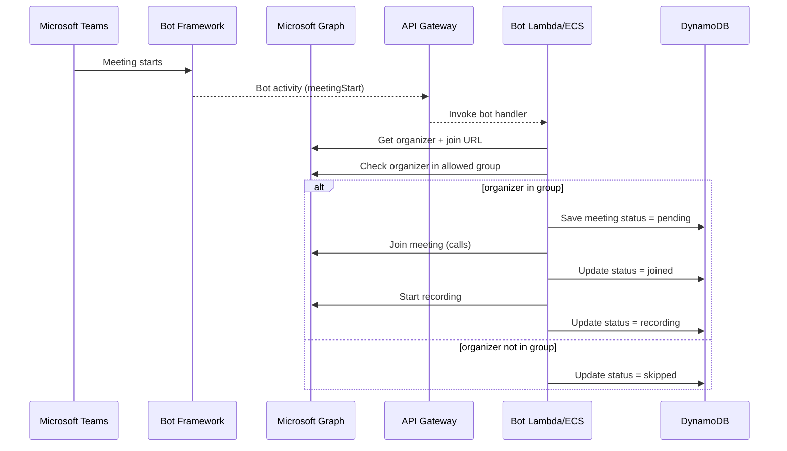

# Teams Meeting Bot - Auto-Recording Specification

## Overview

Build a Microsoft Teams bot that automatically joins meetings and starts recording using Microsoft Graph API. Bot will be hosted on AWS infrastructure.

The bot targets a specific set of users by enforcing an allow-list based on an Entra group. Group membership is evaluated before the bot joins or records a meeting.

---

## Architecture

```
┌─────────────────────────────────────────────────────────────────┐
│                        Microsoft Teams                           │
│  ┌────────────────┐      ┌──────────────┐                      │
│  │ User Creates   │──▶   │ Teams Meeting│                       │
│  │ Meeting        │      │ Started       │                       │
│  └────────────────┘      └──────┬───────┘                       │
│                                  │                                │
└──────────────────────────────────┼────────────────────────────────┘
                                   │ Event
                                   ▼
┌─────────────────────────────────────────────────────────────────┐
│                   Microsoft Teams Bot Framework                  │
│  • Meeting start events (bot activities)                         │
└──────────────────────────────────┬────────────────────────────────┘
                                   │ Activities
                                   ▼
┌─────────────────────────────────────────────────────────────────┐
│                      Microsoft Graph API                         │
│  • /communications/calls/{id}/participants/invite (join)         │
│  • /communications/calls/{id}/record (start recording)           │
└──────────────────────────────────┬────────────────────────────────┘
                                   │ API calls
                                   ▼
┌─────────────────────────────────────────────────────────────────┐
│                         AWS Infrastructure                       │
│                                                                   │
│  ┌──────────────────────────────────────────────────────────┐  │
│  │ API Gateway                                               │  │
│  │  - /bot/callbacks (receive bot activities)                │  │
│  │  - /health                                                │  │
│  └────────────────────────┬─────────────────────────────────┘  │
│                            │                                     │
│                            ▼                                     │
│  ┌──────────────────────────────────────────────────────────┐  │
│  │ Lambda / ECS (Bot Logic)                                  │  │
│  │  1. Receive meeting start notification                    │  │
│  │  2. Extract meeting join URL                              │  │
│  │  3. Bot joins meeting as participant                      │  │
│  │  4. Wait 5 seconds (meeting stability)                    │  │
│  │  5. Start recording via Graph API                         │  │
│  └────────────────────────┬─────────────────────────────────┘  │
│                            │                                     │
│                            ▼                                     │
│  ┌──────────────────────────────────────────────────────────┐  │
│  │ DynamoDB                                                  │  │
│  │  - Active meetings tracking                               │  │
│  │  - Recording status (started/failed)                      │  │
│  │  - Bot join attempts & retries                            │  │
│  └──────────────────────────────────────────────────────────┘  │
│                                                                   │
│  ┌──────────────────────────────────────────────────────────┐  │
│  │ CloudWatch                                                │  │
│  │  - Bot join success/failure metrics                       │  │
│  │  - Recording start success rate                           │  │
│  │  - Alerts for failures                                    │  │
│  └──────────────────────────────────────────────────────────┘  │
└───────────────────────────────────────────────────────────────────┘
```

---

## Required Microsoft Graph Permissions

### Application Permissions (already have some)

- ✅ `OnlineMeetingTranscript.Read.All` - Read transcripts (you have this)
- ✅ `OnlineMeetings.Read.All` - Read meeting details (you have this)
- ⚠️ `OnlineMeetings.ReadWrite.All` - **NEW: Required to start recording**
- ⚠️ `Calls.JoinGroupCall.All` - **NEW: Required for bot to join meetings**
- ⚠️ `Calls.Initiate.All` - **NEW: Required to initiate calls/recording**

### Additional Setup

- **Application Access Policy**: Tenant admin must authorize bot to join meetings
- **Teams App Registration**: Bot needs Teams App manifest and approval
- **Group Allow-List**: Entra group ID used to filter which organizers are eligible

---

## Targeting a Specific User Group (Scalable Approach)

Group calendar subscriptions are not supported with app-only permissions, so the bot uses meeting-start bot activities and filters by group at runtime.

**Approach:**

- Receive meeting-start activities via the Teams bot framework.
- When a meeting starts, look up the organizer user ID.
- If organizer is in the allowed Entra group, proceed. Otherwise, ignore.

**Implementation details:**

- Store `ALLOWED_GROUP_ID` in bot config.
- Cache group membership for 15 minutes to reduce Graph calls.
- Use `GET /groups/{groupId}/members?$select=id` and compare organizer ID.

**Example check (pseudo-code):**

```
if not is_user_in_group(organizer_id, ALLOWED_GROUP_ID):
  return "skip"
```

---

## Implementation Checklist (Group-Targeted Bot)

**Configuration**

- [ ] Add `ALLOWED_GROUP_ID` to bot environment variables
- [ ] Add `GROUP_CACHE_TTL_SECONDS` (default: 900)

**Graph calls**

- [ ] Bot activity: receive Teams meeting start event
- [ ] Organizer lookup: `GET /communications/onlineMeetings/{id}?$select=organizer`
- [ ] Group membership: `GET /groups/{ALLOWED_GROUP_ID}/members?$select=id`
- [ ] Cache membership set for 15 minutes

**Bot flow**

- [ ] If organizer not in group → exit with `skip`
- [ ] If organizer in group → join meeting
- [ ] Start recording after join
- [ ] Log outcome to CloudWatch and DynamoDB

---

## DynamoDB Data Model (Bot Tracking)

**Table:** `meeting-bot-sessions`

**Primary Key**

- `meeting_id` (PK, string)

**Attributes**

- `organizer_id` (string)
- `organizer_email` (string)
- `join_url` (string, optional)
- `call_id` (string, set after bot joins)
- `recording_id` (string, set after recording starts)
- `status` (string: `pending`, `joined`, `recording`, `skipped`, `failed`)
- `error_message` (string, optional)
- `created_at` (ISO timestamp)
- `updated_at` (ISO timestamp)
- `expires_at` (epoch seconds, TTL)

**Indexes (optional)**

- GSI: `status` + `updated_at` for operational dashboards
- GSI: `organizer_id` for audits

---

## Event Schemas (Webhook + Bot Callbacks)

**Bot Activity: Meeting Started (Teams Bot Framework)**

```
{
  "type": "event",
  "name": "application/vnd.microsoft.teams.meetingStart",
  "channelId": "msteams",
  "from": { "id": "{user-id}", "aadObjectId": "{organizer-id}" },
  "conversation": { "id": "{conversation-id}" },
  "channelData": {
    "meeting": {
      "id": "{meeting-id}",
      "joinUrl": "{join-url}"
    }
  }
}
```

**Bot Join Result (Internal Event)**

```
{
  "meeting_id": "{meeting-id}",
  "organizer_id": "{organizer-id}",
  "action": "join",
  "status": "joined",
  "call_id": "{call-id}",
  "timestamp": "2026-02-13T05:00:00Z"
}
```

**Recording Start Result (Internal Event)**

```
{
  "meeting_id": "{meeting-id}",
  "action": "record",
  "status": "recording",
  "recording_id": "{recording-id}",
  "timestamp": "2026-02-13T05:00:05Z"
}
```

**Failure Event (Internal)**

```
{
  "meeting_id": "{meeting-id}",
  "action": "join|record",
  "status": "failed",
  "error_message": "...",
  "timestamp": "2026-02-13T05:00:06Z"
}
```

---

## Sequence Diagram (Webhook → Join → Record)



---

## AWS Hosting Options

### Option 1: AWS Lambda (Recommended for MVP) ⭐

**Pros:**

- ✅ Serverless, auto-scaling
- ✅ Pay per invocation
- ✅ Fits existing infrastructure (you already use Lambda)
- ✅ Easy integration with API Gateway + DynamoDB

**Cons:**

- ❌ 15-minute execution limit (may disconnect from long meetings)
- ❌ Cold starts (2-5 second delay)

**Use Case:** Bot joins, starts recording, exits (quick operation)

**Architecture:**

```
Lambda Function (Node.js 18 or Python 3.11)
├── Environment Variables
│   ├── GRAPH_TENANT_ID
│   ├── GRAPH_CLIENT_ID
│   ├── GRAPH_CLIENT_SECRET
│   ├── GRAPH_APP_ID (Teams bot app ID)
│   └── BOT_SECRET
├── Layers
│   ├── Microsoft Graph SDK
│   └── Teams Bot SDK
└── Timeout: 300 seconds (5 min)
```

**Cost:** $0.20-2.00/month (20-200 meetings/month)

---

### Option 2: AWS ECS Fargate (Long-Running Bot)

**Pros:**

- ✅ Can stay in meeting for duration
- ✅ No execution time limit
- ✅ Better for complex bot interactions
- ✅ Easier debugging (persistent logs)

**Cons:**

- ❌ Higher cost (always running)
- ❌ More complex deployment

**Use Case:** Bot needs to stay in meeting, monitor conversation, respond to commands

**Architecture:**

```
ECS Task Definition
├── Container Image: teams-recording-bot
│   ├── Base: node:18-alpine or python:3.11-slim
│   ├── Port: 8080 (webhook listener)
│   └── Health Check: /health
├── Task Size
│   ├── CPU: 0.25 vCPU
│   └── Memory: 512 MB
└── Service
    ├── Tasks: 1 (min), 3 (max)
    └── Auto-scaling: Based on webhook queue depth
```

**Cost:** $10-30/month (1 task running 24/7)

---

### Option 3: EC2 (Not Recommended)

**Use Case:** Only if you need full VM control or very specific dependencies

**Cost:** $30-50/month minimum

**Verdict:** Overkill for this use case

---

## Implementation Phases

## Implementation TODO (IaC + Code)

- [ ] Add bot runtime (Lambda or ECS) with IAM role and logging
- [ ] Add API Gateway routes: `/bot/meeting-started`, `/bot/callbacks/*`
- [ ] Add DynamoDB table `meeting-bot-sessions`
- [ ] Add Secrets Manager entries for bot app ID and secret
- [ ] Add bot environment variables (group allow-list, cache TTL)
- [ ] Add CloudWatch alarms for bot failures
- [ ] Configure Teams bot messaging endpoint (bot framework)
- [ ] Add group allow-list check + cache logic
- [ ] Add join + record flow + status persistence
- [ ] Add end-to-end test script for bot flow

### Phase 1: Meeting Event Ingestion (Week 1)

**Goal:** Receive bot activities when meetings start

**Tasks:**

1. Configure Teams bot messaging endpoint

- Set bot endpoint to `https://api-gateway-url/bot/callbacks`
- Install/sideload Teams app with bot definition

2. Create Lambda/ECS bot activity receiver

- Parse meeting start activity payload
- Extract meeting ID and join URL if available

- Extract organizer ID and check group membership
- Store in DynamoDB (meeting_id, join_url, status: pending)

3. Test with manual meeting creation

**Deliverables:**

- Bot endpoint receiving meeting start activities ✅
- DynamoDB storing active meetings ✅

---

### Phase 2: Bot Joins Meeting (Week 2-3)

**Goal:** Bot automatically joins Teams meeting

**Tasks:**

1. Register Teams Bot Application
   - Azure Portal → Bot Services → Create
   - Generate bot secret

- Configure messaging endpoint: `https://api-gateway-url/bot/callbacks`

2. Implement bot join logic

   ```javascript
   // Pseudo-code
   async function joinMeeting(meetingJoinUrl, meetingId) {
     const graphClient = getAuthenticatedClient();

     // Join meeting as bot participant
     const joinRequest = {
       participants: [
         {
           identity: {
             application: {
               id: process.env.BOT_APP_ID,
               displayName: 'Recording Bot',
             },
           },
         },
       ],
       callbackUri: `https://api-gateway-url/bot/callbacks/${meetingId}`,
     };

     const response = await graphClient.api(`/communications/calls`).post({
       subject: 'Recording Bot',
       source: joinRequest.participants[0],
       meetingInfo: {
         joinUrl: meetingJoinUrl,
       },
     });

     return response.id; // Call ID for recording
   }
   ```

3. Handle bot callbacks (call state changes)

**Deliverables:**

- Bot successfully joins meetings ✅
- Call ID tracked in DynamoDB ✅

---

### Phase 3: Start Recording (Week 3-4)

**Goal:** Bot initiates recording after joining

**Tasks:**

1. Implement recording start

   ```javascript
   async function startRecording(callId, meetingId) {
     const graphClient = getAuthenticatedClient();

     // Wait 5 seconds for call to stabilize
     await sleep(5000);

     // Start recording
     const recordingRequest = {
       clientContext: meetingId, // Track which meeting
     };

     const response = await graphClient
       .api(`/communications/calls/${callId}/record`)
       .post(recordingRequest);

     return response.id; // Recording operation ID
   }
   ```

2. Handle recording state notifications
   - Recording started successfully
   - Recording failed (retry logic)
   - Recording ended

3. Update DynamoDB with recording status

**Deliverables:**

- Bot starts recording automatically ✅
- Recording status tracked ✅
- Failed recordings logged + alerted ✅

---

### Phase 4: Error Handling & Monitoring (Week 4-5)

**Goal:** Robust error handling and observability

**Tasks:**

1. Retry logic
   - Join failures: Retry 3 times with exponential backoff
   - Recording failures: Notify admin via SNS

2. CloudWatch metrics
   - `BotJoinSuccess` (counter)
   - `BotJoinFailure` (counter)
   - `RecordingStartSuccess` (counter)
   - `RecordingStartFailure` (counter)
   - `MeetingProcessingDuration` (histogram)

3. Alarms
   - Recording failure rate > 10%
   - Bot not responding to webhooks

4. DLQ for failed webhook processing

**Deliverables:**

- Comprehensive error handling ✅
- Real-time monitoring dashboard ✅
- Alerting configured ✅

---

## Code Structure

### Lambda Function (Recommended)

```
lambda/
├── meeting-bot/
│   ├── handler.py (or index.js)
│   ├── graph_client.py
│   ├── bot_manager.py
│   ├── recording_manager.py
│   └── models/
│       ├── meeting.py
│       └── recording.py
├── requirements.txt (or package.json)
└── Dockerfile (optional, for local testing)
```

### Key Functions

**handler.py:**

```python
def webhook_handler(event, context):
    """Receive meeting start notification from Graph API"""
    notification = parse_webhook(event)
    meeting_id = notification['resource']['id']
    join_url = notification['resource']['joinUrl']

    # Store in DynamoDB
    save_meeting(meeting_id, join_url, status='pending')

    # Trigger bot join (async)
    invoke_bot_join(meeting_id, join_url)

    return {'statusCode': 202}

def bot_join_handler(event, context):
    """Bot joins meeting and starts recording"""
    meeting_id = event['meeting_id']
    join_url = event['join_url']

    try:
        # Join meeting
        call_id = join_meeting(join_url, meeting_id)
        update_meeting(meeting_id, call_id=call_id, status='joined')

        # Start recording
        recording_id = start_recording(call_id, meeting_id)
        update_meeting(meeting_id, recording_id=recording_id, status='recording')

        # Emit metrics
        cloudwatch.put_metric('RecordingStartSuccess', 1)

        return {'statusCode': 200, 'recording_id': recording_id}

    except Exception as e:
        cloudwatch.put_metric('RecordingStartFailure', 1)
        sns.publish('Recording failed for meeting: ' + meeting_id)
        raise
```

---

## Terraform Infrastructure

### New Resources Needed

```hcl
# Lambda function for bot
resource "aws_lambda_function" "meeting_bot" {
  function_name = "tmf-meeting-bot-${var.environment}"
  runtime       = "python3.11"
  handler       = "handler.webhook_handler"
  role          = aws_iam_role.bot_role.arn
  timeout       = 300  # 5 minutes
  memory_size   = 512

  environment {
    variables = {
      GRAPH_TENANT_ID     = var.azure_graph_tenant_id
      GRAPH_CLIENT_ID     = var.azure_graph_client_id
      GRAPH_CLIENT_SECRET = var.azure_graph_client_secret
      BOT_APP_ID          = var.azure_bot_app_id
      MEETINGS_TABLE      = aws_dynamodb_table.meetings.name
    }
  }
}

# DynamoDB table for meeting tracking
resource "aws_dynamodb_table" "meetings" {
  name         = "active-meetings"
  billing_mode = "PAY_PER_REQUEST"
  hash_key     = "meeting_id"

  attribute {
    name = "meeting_id"
    type = "S"
  }

  ttl {
    attribute_name = "expires_at"
    enabled        = true
  }
}

# API Gateway endpoint for webhooks
resource "aws_api_gateway_resource" "meeting_webhook" {
  rest_api_id = aws_api_gateway_rest_api.api.id
  parent_id   = aws_api_gateway_rest_api.api.root_resource_id
  path_part   = "meeting-started"
}

resource "aws_api_gateway_method" "meeting_webhook_post" {
  rest_api_id   = aws_api_gateway_rest_api.api.id
  resource_id   = aws_api_gateway_resource.meeting_webhook.id
  http_method   = "POST"
  authorization = "NONE"  # Secured by client state validation
}

# CloudWatch alarms
resource "aws_cloudwatch_metric_alarm" "recording_failures" {
  alarm_name          = "tmf-recording-failures-${var.environment}"
  comparison_operator = "GreaterThanThreshold"
  evaluation_periods  = 1
  metric_name         = "RecordingStartFailure"
  namespace           = "TMF/Bot"
  period              = 300
  statistic           = "Sum"
  threshold           = 3
  alarm_actions       = [aws_sns_topic.notifications.arn]
}
```

---

## Deployment Steps

### 1. Azure Setup

```bash
# Add new permissions to app registration
az ad app permission add \
  --id fd190b50-0567-4c80-ad1f-36eaab452db7 \
  --api 00000003-0000-0000-c000-000000000000 \
  --api-permissions \
    16409ce7-e136-4f61-8878-27f2aef8fac2=Role \
    284383ee-7f6e-4e40-a2a8-e85dcb029101=Role \
    a65f2972-a4f8-4f5e-afd7-69ccb046d5dc=Role

# Grant admin consent
az ad app permission admin-consent \
  --id fd190b50-0567-4c80-ad1f-36eaab452db7

# Create Teams bot registration
# (Manual step in Azure Portal → Bot Services)
```

### 2. Deploy AWS Infrastructure

```bash
cd iac/aws
terraform init
terraform plan -var-file=terraform.tfvars
terraform apply
```

### 3. Deploy Bot Code

```bash
cd lambda/meeting-bot
pip install -r requirements.txt -t .
zip -r bot.zip .
aws lambda update-function-code \
  --function-name tmf-meeting-bot-dev \
  --zip-file fileb://bot.zip \
  --profile tmf-dev
```

### 4. Install Teams Bot App

- Update the Teams app manifest with the bot ID
- Upload/sideload the app in Teams Admin Center
- Verify the bot messaging endpoint is set to `https://api-gateway-url/bot/callbacks`

### 5. Test

```bash
# Create test meeting
python scripts/graph/create-test-meeting-auto.py

# Monitor logs
aws logs tail /aws/lambda/tmf-meeting-bot-dev --follow
```

---

## Cost Breakdown (AWS Hosting)

### Lambda Option (Recommended)

- **Lambda executions**: 100 meetings/month × $0.0000002/request = $0.02
- **Lambda duration**: 100 × 10 seconds × $0.0000166667/GB-second = $0.17
- **API Gateway**: 200 requests/month × $3.50/million = $0.0007
- **DynamoDB**: Pay-per-request, ~$0.10/month
- **CloudWatch**: Logs + metrics = $2-5/month
- **Total**: **$2.50-5.50/month**

### ECS Option

- **Fargate**: 1 task × 0.25 vCPU × $0.04048/hour × 730 hours = $7.39
- **Fargate**: 1 task × 0.5 GB × $0.004445/hour × 730 hours = $1.62
- **Load Balancer**: Optional, +$16/month
- **Total**: **$9-25/month**

---

## Security Considerations

1. **Bot Identity**: Bot appears as participant "Recording Bot" in meeting
2. **Privacy**: Some regions/tenants prohibit automated recording without consent
3. **Compliance**: May need user notification that bot is recording
4. **Secrets**: Store Graph credentials in AWS Secrets Manager (add $0.40/month)

---

## Limitations & Workarounds

| Limitation                                       | Workaround                                                             |
| ------------------------------------------------ | ---------------------------------------------------------------------- |
| Bot can only join meetings where invited/allowed | Add bot to Entra group that has meeting access                         |
| 15-min Lambda timeout                            | Use Lambda for join+record, then exit. Recording continues server-side |
| Cold starts delay bot join                       | Use provisioned concurrency (add cost) OR accept 5-10 sec delay        |
| Meeting policy may block bot                     | Tenant admin must whitelist bot app ID                                 |

---

## Success Metrics

- **Bot join success rate**: Target 95%+
- **Recording start success rate**: Target 90%+ (some meetings may fail due to policy)
- **Time to recording**: < 15 seconds from meeting start
- **Transcript availability**: Current system (manual recording) already working

---

## Timeline Summary

- **Week 1**: Meeting event subscription + webhook receiver
- **Week 2**: Bot joins meetings automatically
- **Week 3**: Bot starts recording
- **Week 4**: Error handling + monitoring
- **Week 5**: Testing + documentation

**Total**: 4-5 weeks for production-ready bot

---

## Alternative: Hybrid Approach

**Use existing system + add bot for specific high-priority meetings:**

1. Default: Users manually record (current system ✅)
2. Bot: Auto-record for meetings with specific tag/category
3. PowerAutomate: Send reminder for all other meetings

Reduces development scope while still providing automation where needed most.
